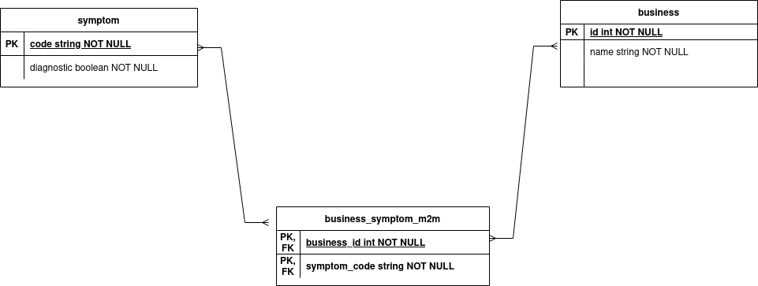

# AdviNow Interview Challenge
This repository will be used as a test case for interview candidates. The application structure is predefined using FastAPI and uvicorn in the "app" directory in the "run.py" module. 
FastAPI creates API docs automatically, and these can be found at "http://127.0.0.1:8013/docs" when the app is running.

Please follow the instructions below to define data modules, generate a database through migration files, and create an API to return symptom data based on business logic.

Below are all the tasks/expectations required to complete this challenge. These tasks are not listed in any defined order, and you may go about these tasks in any order you see best:

**Please organize these tasks and update the ReadMe based on the order you complete them!**

## Initial List
- Create data models - example with sqlalchemy in "app\models.py"
- Create an endpoint that returns business and symptom data
  - Endpoint should take two optional parameters - business_id & diagnostic
  - Endpoint should return Business ID, Business Name, Symptom Code, Symptom Name, and Symptom Diagnostic values based on filter
- Generate migration script and run migration to create database tables - alembic files provided
  - To create a migration file: "alembic revision --autogenerate -m some_comment"
  - To update database with migration file: "alembic upgrade head"
- Design a database mock up based on the provided data - "app\data\business_symptom_data.csv"
- Create an endpoint for importing a CSV file into the database
  - The only requirement is the endpoint requires a CSV file. If needed, other parameters can be used.
- Create a virtual environment and install the requirements - "requirements\requirements.txt"

## Ordered List
1. **Create a virtual environment and install the requirements - "requirements\requirements.txt"** Created virtual environment in `env/`, installed initial requirements in `requirements/requirements.txt`. Although it is convention to exclude such content from commits using an ignore file, I will be including this here as proof I did in fact create a virtual environment.

3. **Design a database mock up based on the provided data - "app\data\business_symptom_data.csv"** Created an ERD that conveys my intentions for database design. Three tables are captured. One for business data, one for symptom data, and another acting as an association table for the suspected M2M relationship between the two.

3. **Create data models - example with sqlalchemy in "app\models.py"** Created new models in `app/models.py` using SQLAlchemy. These include "business", "symptom", and a M2M association lookup table that resolves the Many-to-Many relationship I can understand from `app/data/business_symptom_data.csv`. Defined primary keys to be "Business ID" and "Symptom Code" for business and symptom tables respectively, assuming that uniqueness holds according to sample data.

4. **Generate migration script and run migration to create database tables - alembic files provided** Generated new Alembic migration `alembic/versions/2023_03_20_2304-8f0e1fbfa2b2-init.py`. Ran migration against PostgreSQL database container. Also set up Docker Compose YAML file here for UPnP setup. Created Dockerfile for a light FastAPI ready image as well to run API. Passed credentials into containers, setup entrypoints, then ran migration and viewed contents of database to make sure changes were present with `psql` CLI tool.

5. **Create an endpoint for importing a CSV file into the database** Created POST endpoint "/csv" with UploadFile handle to handle CSV imports to database. Created Pydantic models for data validation, particularly for various forms of the boolean field for diagnostic data, which Pydantic can handle quite well. Validated and deduped data as much as possible, likely poor on space complexity. Made efforts to reduce attempted writes with data already present by querying for primary keys before hand for Business, Symptom, using filter for iterable through deduped data, then writing where the filter iterable guarantees new value. M2M lookup table also populated accordingly.

6. **Create an endpoint that returns business and symptom data** Created GET endpoint "/resources" accepting the requested parameters. Crafts queries by filter chaining for Business ID, but for Diagnostic across M2M, eager loads and filters by boolean column accordingly. Setup additional Pydantic models here with ORM Mode turned on, Business and Resource respectively.

As a note, FastAPI, uvicorn, sqlalchemy, and alembic are not required to be used and may be changed if desired. 
Any of the existing files or variables can be and may need to be changed or updated, please be prepared to explain changes on the follow-up call.
The final end result should be a filled database, two working APIs, and an accessible API docs page.
